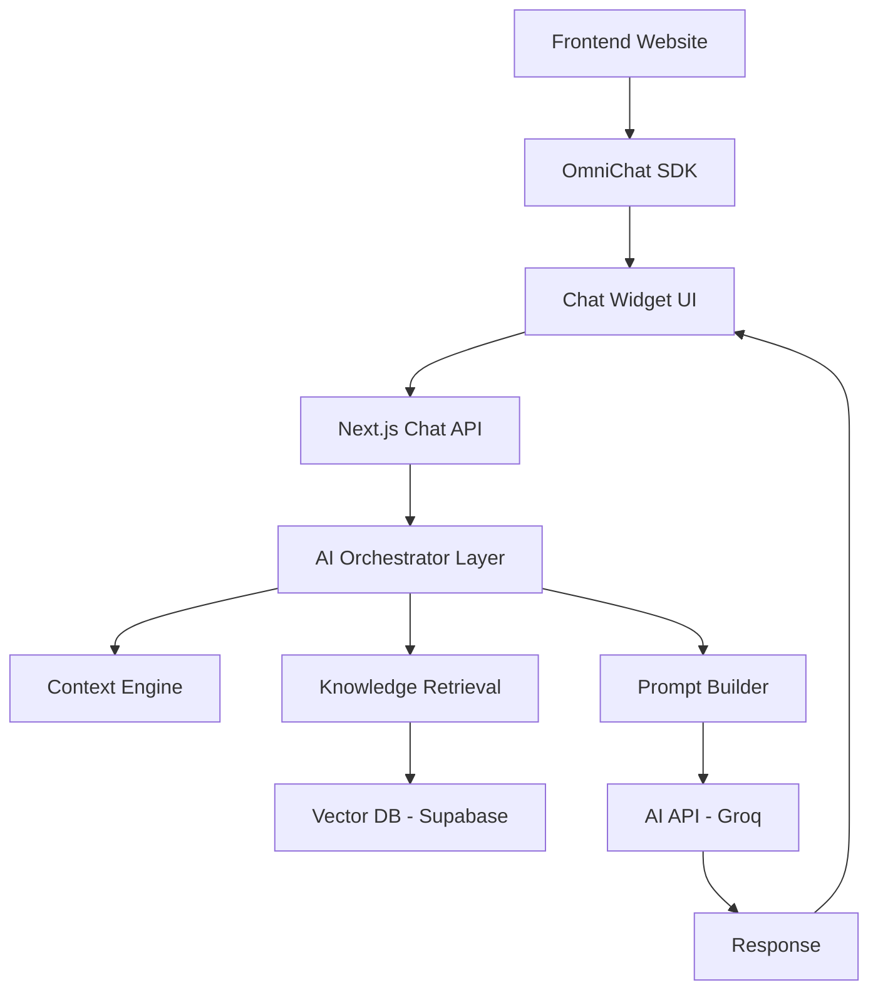

# OmniChat AI — Universal Context-Aware Chatbot Platform

Build a chatbot platform that can integrate into **any web product**, automatically understand application environment, user session, database structure, page context, and workflows to provide **accurate, intelligent, contextual responses**.

---

## 🚀 Project Progress

**Overall Progress: 10%**  

- [x] Phase 1: Foundation (In Progress)
- [ ] Phase 2: Context System
- [ ] Phase 3: Knowledge System
- [ ] Phase 4: Memory System
- [ ] Phase 5: Universal SDK
- [ ] Phase 6: Admin Dashboard
- [ ] Phase 7: Optimization
- [ ] Phase 8: Production Deployment

---

## 1. Project Proposal

### Vision
Build a chatbot platform that can integrate into **any web product**, automatically understand:
* Application environment
* User session
* Database structure
* Page context
* Workflows

and provide **accurate, intelligent, contextual responses**.

### Core Objectives
* Universal integration SDK
* Context-aware AI responses
* Automatic middle prompt generation
* High accuracy via RAG
* Free AI API based infrastructure
* Multi-product support

---

## 2. System Architecture

---

## 3. Phase-by-Phase Roadmap

### Phase 1 — Foundation (Week 1)
**Goal:** Basic chatbot working with AI API.
- [x] Next.js project setup
- [ ] Chat API route implementation
- [ ] Groq API integration
- [ ] Basic chat UI
- [ ] Environment variables setup

### Phase 2 — Context System (Week 2)
**Goal:** Environment-aware chatbot.
- [ ] Context extractor development
- [ ] Dynamic prompt builder
- [ ] Context injection system
- [ ] URL & Session capture logic

### Phase 3 — Knowledge System (Week 3)
**Goal:** Accurate chatbot using knowledge (RAG).
- [ ] Supabase setup & Vector DB configuration
- [ ] Embedding system implementation
- [ ] Retrieval algorithm (Semantic Search)
- [ ] Document processing pipeline

### Phase 4 — Memory System (Week 4)
**Goal:** Chatbot remembers conversation.
- [ ] Conversation storage schema
- [ ] Memory retrieval logic
- [ ] Session management
- [ ] Multi-turn conversation handling

### Phase 5 — Universal SDK (Week 5)
**Goal:** Integrate chatbot into any website.
- [ ] Bundleable JS SDK
- [ ] `chatbot.init()` and `mount()` methods
- [ ] Cross-domain communication (postMessage)
- [ ] Authentication & Security

### Phase 6 — Admin Dashboard (Week 6)
**Goal:** Manage chatbot and knowledge.
- [ ] Project management dashboard
- [ ] Knowledge base upload (CSV/PDF/Link)
- [ ] Conversation logs & Analytics
- [ ] Usage monitoring

### Phase 7 — Optimization (Week 7)
**Goal:** Improve accuracy and speed.
- [ ] Prompt engineering refinement
- [ ] Response caching
- [ ] Vector search tuning (re-ranking)
- [ ] Performance benchmarking

### Phase 8 — Production Deployment (Week 8)
**Goal:** Live production system.
- [ ] Vercel deployment
- [ ] Database hardening
- [ ] CI/CD pipeline setup
- [ ] Final QA & Launch

---

## 4. Technology Stack

| Layer | Technology |
| --- | --- |
| **Frontend** | Next.js, React, Tailwind CSS |
| **Backend** | Next.js API Routes, Node.js |
| **Database** | Supabase (PostgreSQL + pgvector) |
| **AI Engine** | Groq (Llama 3), OpenAI SDK |
| **Hosting** | Vercel |

---

## 5. Database Design

### Projects Table
`id, name, api_key, created_at, user_id`

### Conversations Table
`id, project_id, user_id, message, response, timestamp`

### Knowledge Table
`id, project_id, content, embedding (vector), metadata`

---

## 6. Getting Started

1. Clone the repository
2. Install dependencies: `npm install`
3. Setup `.env.local` with your Groq and Supabase keys.
4. Run locally: `npm run dev`
